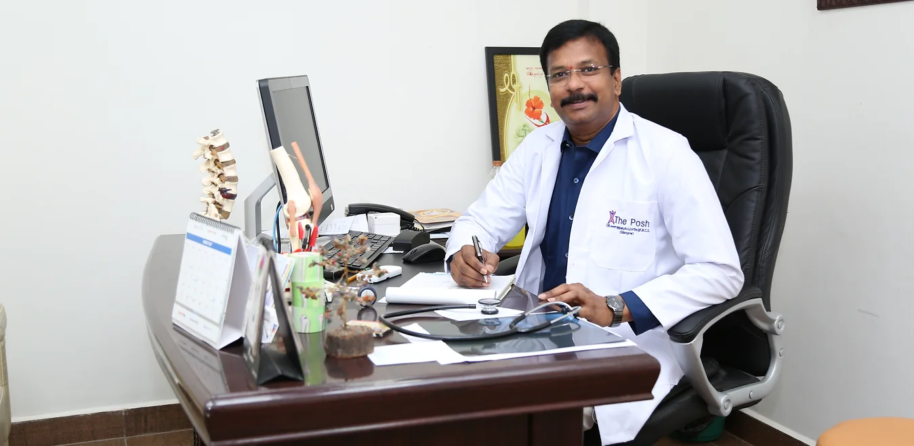
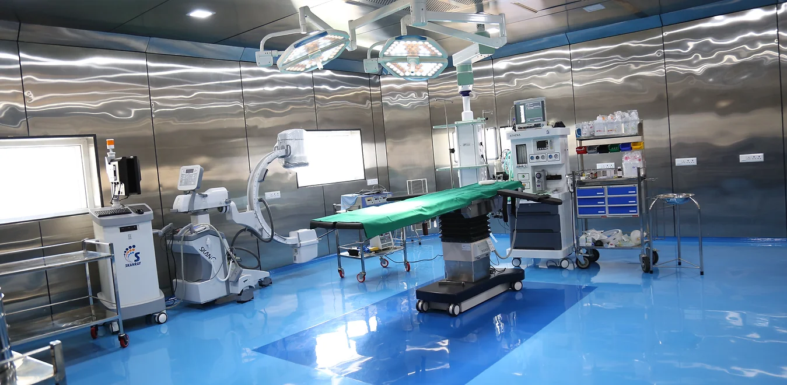
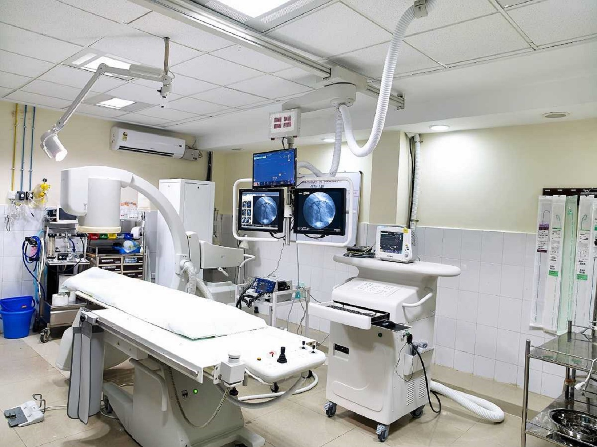
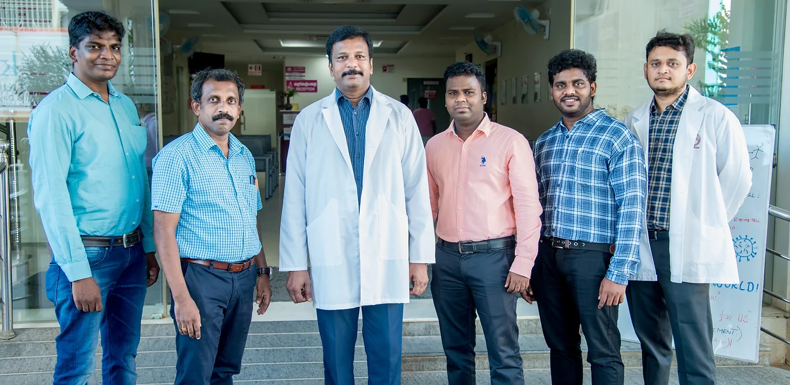
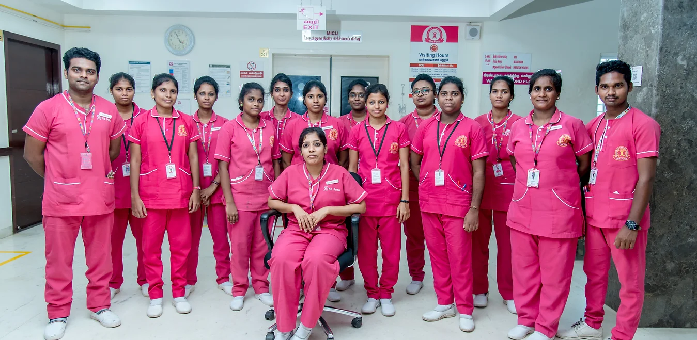
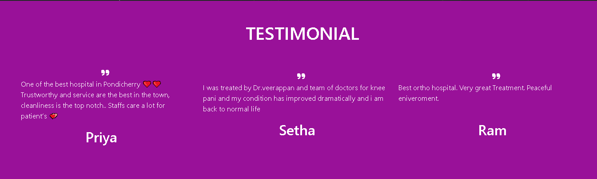
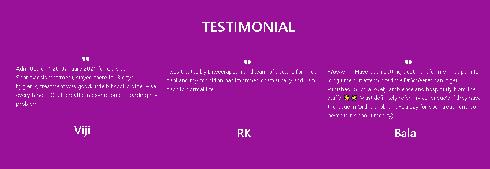
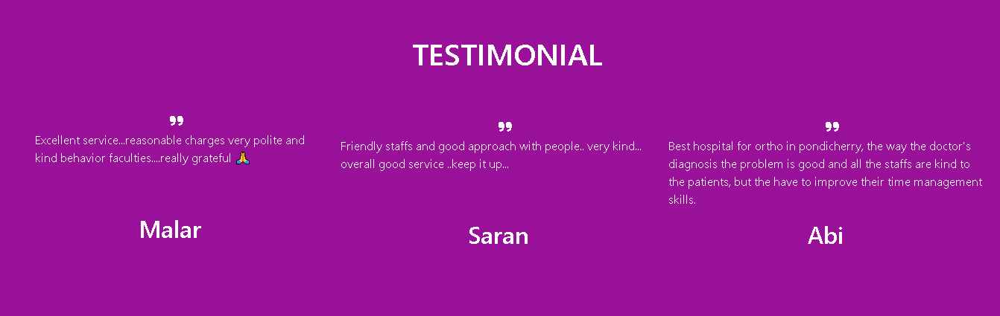

<!DOCTYPE html>
<html lang="en">
<head>
    <meta charset="UTF-8">
    <meta name="viewport" content="width=device-width, initial-scale=1.0">
    <title>Hospital</title>
    <link href="https://cdn.jsdelivr.net/npm/bootstrap@5.2.3/dist/css/bootstrap.min.css" rel="stylesheet" integrity="sha384-rbsA2VBKQhggwzxH7pPCaAqO46MgnOM80zW1RWuH61DGLwZJEdK2Kadq2F9CUG65" crossorigin="anonymous">
    
    <link rel="preconnect" href="https://fonts.googleapis.com">
    <link rel="preconnect" href="https://fonts.gstatic.com" crossorigin>
    <link href="https://fonts.googleapis.com/css2?family=Poppins&display=swap" rel="stylesheet">
    
    
</head>
<body>
    

        

            

                <a href="#"><i class="fa-brands fa-square-facebook"></i></a>
                <a href="#"><i class="fa-brands fa-instagram"> </i></a>
                <a href="#"><i class="fa-brands fa-twitter"></i></a>
                <a href="#"><i class="fa-brands fa-whatsapp"></i></a>
            

            

                
Call Now : 0413-2200017 -18 / 4210018 / 080565 55330

            

            

                <a href="#"><i class="fas fa-ambulance fa-2x"></i> 24/7 </a>
            

        

    

    <nav class=" navbar-expand-sm container-fluid bg-light" id="head">
        

            
            <h1 class="col p-6" style=" margin-top: 45px; text-align: left;">THE POSH-PONDY ORTHO SPECIALITY HOSPITAL</h1>
        

    </nav>
    

        <button class="navbar-toggler" type="button" data-bs-toggle="collapse" data-bs-target="#navbarSupportedContent" aria-controls="navbarSupportedContent" aria-expanded="false" aria-label="Toggle navigation">
            
        </button>
        <ul>
            <li class="nav-item"><a href="#home" class="col p-2">HOME</a></li>
            <li class="nav-item"><a href="#service" class="col p-2">SERVICES</a></li>
            <li class="nav-item"><a href="#About" class="col p-2">ABOUT</a></li>
            <li class="nav-item"><a href="#dept" class="col p-2">DEPARTMENT</a></li>
            <li class="nav-item"><a href="#htips" class="col p-2">HEALTH TIPS</a></li>
            <li class="nav-item"><a href="#test" class="col p-2">TESTIMONIALS</a></li>
            <li class="nav-item"><a href="#footer" class="col p-2">CONTACT</a></li>
        </ul> 
    

    

        <!-- Indicators/dots -->
        

          <button type="button" data-bs-target="#demo" data-bs-slide-to="0" class="active"></button>
          <button type="button" data-bs-target="#demo" data-bs-slide-to="1"></button>
          <button type="button" data-bs-target="#demo" data-bs-slide-to="2"></button>
        

        
        <!-- The slideshow/carousel -->
        

          

            
          

          

            
          

          

            
          

        

        
        <!-- Left and right controls/icons -->
        <button class="carousel-control-prev" type="button" data-bs-target="#demo" data-bs-slide="prev">
          
        </button>
        <button class="carousel-control-next" type="button" data-bs-target="#demo" data-bs-slide="next">
          
        </button>
        
      

    

    

        

            SERVICES
        

    

      
      
    

        

            

                

                    <a class="service-item rounded"  id="box" href="#">
                        

                            

                                <i class="fa fa-hospital-alt fa-2x" style="color: #ec09a4;"></i>
                            

                        

                        <h5 style="color: blue;">DEPARTMENTS</h5>
                        
The Posh Hospital is a multispeciality hospital that has 14 departments that are fully-functional, ably-staffed and well-equipped.

                    </a>
                

                

                    <a class="service-item rounded"  id="box" href="#">
                        

                            

                                <i class="fa fa-heartbeat fa-2x" style="color: #ec09a4;"></i>
                            

                        

                        <h5 class="mb-3" style="color: blue;">HEALTH TIPS</h5>
                        
Making suitable lifestyle choices may also help men and women prevent some health problems.

                    </a>
                

                

                    <a class="service-item rounded"  id="box" href="#">
                        

                            

                                <i class="fa fa-stethoscope fa-2x" style="color: #ec09a4;"></i>
                            

                        

                        <h5 class="mb-3" style="color: blue;">FIND A DOCTOR</h5>
                        
Well trained and experienced senior physicians work as a single team in tackling severe cases and critically ill patients.

                    </a>
                

                

                    <a class="service-item rounded"  id="box" href="#">
                        

                            

                                <i class="fa fa-user-md fa-2x" style="color: #ec09a4;"></i>
                            

                        

                        <h5 class="mb-3" style="color: blue;">TESTIMONIALS</h5>
                        
We love that our patients feel inspired to write about the care they received here at new medical centre.

                    </a>
                

                

                    <a class="service-item rounded"  id="box" href="#">
                        

                            

                                <i class="fa fa-heart-o fa-2x" style="color: #ec09a4;"></i>
                            

                        

                        <h5 class="mb-3" style="color: blue;">HAPPY CLIENTS</h5>
                        
Our success is measured by results, the most important being how our clients feel about their experience with us.

                    </a>
                

                

                    <a class="service-item rounded"  id="box" href="#">
                        

                            

                                <i class="fa fa-wheelchair fa-2x" style="color: #ec09a4;"></i>
                            

                        

                        <h5 class="mb-3" style="color: blue;">FACILITIES</h5>
                        
Sometimes, the best thing we can do for our patients is to tell them what the best behavior is and then negotiate something they can live with.

                    </a>
                

            

        

    

      
      

        

        ABOUT US
        

      

      
      <section style="background-color: black;">
        

            

                

                    
                

                

                    
“Welcome to THE POSH . We operate at PONDICHERRY as a private surgical hospital, and our focus is on delivering quality care and value for money. We play a key role in improving the health of PONDICHERRY , by providing access to quality elective surgical services round the year.​​

                    
​The POSH represents about the private ORTHO surgery market in the town and, across a wide range of medical specialties.. Although we operate independently, with a separate Board of Directors, we make up part of businesses that include Health Insurance, Primary Care. The Posh reaches all the people in and around the territory, making it one of the most well known and trusted healthcare hospitals.

                    
​Its range of health care and services, combined with a not-for-profit focus and significant size and experience, gives The Posh an important role in the Pondicherry health sector. Since we were established in 2005 as Pondy Ortho Clinic . We have grown in both size and scope of services offered as The POSH in 2017 . We’re passionate about achieving our vision.

                    

            

        

    </section>
      
      

        

        DEPARTMENT
        

      

      

      

        <!-- Indicators/dots -->
        

          <button type="button" data-bs-target="#demo" data-bs-slide-to="0" class="active"></button>
          <button type="button" data-bs-target="#demo" data-bs-slide-to="1"></button>
          <button type="button" data-bs-target="#demo" data-bs-slide-to="2"></button>
        

        
        <!-- The slideshow/carousel -->
        

          

            
          

          

            
          

        
        <!-- Left and right controls/icons -->
        <button class="carousel-control-prev" type="button" data-bs-target="#demo" data-bs-slide="prev">
          
        </button>
        <button class="carousel-control-next" type="button" data-bs-target="#demo" data-bs-slide="next">
          
        </button>
    

    <section id="Portfolio" class="p-5" style="background-color: black;">
        

            

                

                    

                        

                            <i class="servicesIcon fas fa-user-md fa-2x"></i>
                            <h4 class="card-title mt-3">WELL TRAINED STAFFS ENGAGING IN PERSONALISED CARE!</h4>
                            
One of the biggest advantages of OUR POSH is the holistic treatment we can offer you. We have a family of well trained experienced staffs who gives you constant care and we are conducting them regular seminars and symposiums regarding recent medical updates.We will give you consistent care from diagnosis through to recovery and after-care. We concentrate more on the patients rather than the diseases which helps in achieving remendous health care to the patients.

                        

                    
  
                

                

                    

                        

                            <i class='servicesIcon fas fa-clinic-medical fa-2x'></i>
                            <h4 class="card-title mt-3">BEST HYGIENIC HOSPITAL IN PUDUCHERRY!</h4>
                            
OUR POSH was awarded first rank in the level of sanitation and cleanliness services and awarded SWACHH BHARAT MISSION SWACHH RANKING CERTIFICATE by government of puducherry in the year 2019. We also have zero infection rate in operation theatres for the past 5 years and we try to achieve it in the future.                            

                        

                    
  
                

                

                    

                        

                            <i class="servicesIcon fas fa-diagnoses fa-2x"></i>
                            <h4 class="card-title mt-3">SURGERY WITHIN 24 HOURS OF ADMISSION!</h4>
                            
One of our biggest flex we tend to operate the patient within 24 hours of admission which is considered as a GOLDEN PERIOD in our field. We have a set of operating teams consisting surgeons of various departments(refer our doctors to know more) who works round the clock to make it possible.

                        

                    
  
                

            

        

    </section>

      
      

        

        HEALTH TIPS
        

      

    
    <section class=" row" id="RRR" style="background-color: black;">
    

      

        

            <h1>Consume less salt and sugar </h1>
            
Filipinos consume twice the recommended amount of sodium, putting them at risk of high blood pressure, which in turn increases the risk of heart disease and stroke. Most people get their sodium through salt.

            

                <i class="fa fa-heartbeat fa-2x"></i>
            

        

        

            <h1>Eat a healthy diet</h1>
            
Eat a combination of different foods, including fruit, vegetables, nuts and whole grains. Adults should eat at least five portions of fruit and vegetables per day.Eating fresh fruit and vegetables as snacks;

            

             <i class="fa fa-heart-o fa-2x"></i>
            

        

      

    

    
    
    

      

        

            <h1>Avoid harmful use of alcohol </h1>
            
Consuming alcohol can lead to health problems such as mental and behavioural disorders, liver cirrhosis, cancers and heart diseases, as well as injuries resulting from violence and road clashes and collisions.

            

                <i class="fa fa-heartbeat fa-2x"></i>
            

        

        

          <h1>Don’t smoke</h1>
          
Tobacco kills not only the direct smokers but even non-smokers through second-hand exposure.  Currently, there are around 15.9 million Filipino adults who smoke tobacco but 7 in 10 smokers are interested or plan to quit. 

          

          <i class="fa fa-heart-o fa-2x"></i>
          

        

      

    

    
    

      

        

            <h1>Clean your hands properly</h1>
            
Clean hands can prevent the spread of infectious illnesses. You should handwash using soap and water when your hands are visibly soiled or handrub using an alcohol-based product.

            

                <i class="fa fa-heartbeat fa-2x"></i>
            

        

        

            <h1> Be active</h1>
            
This includes exercise and activities undertaken while working, playing, travelling, and engaging in recreational pursuits. You need depends on your age group  should do moderate-intensity throughout the week.

             

            <i class="fa fa-heart-o fa-2x"></i>
           

        

      

    

    </section>
    

        <!-- Indicators/dots -->
        

          <button type="button" data-bs-target="#demo" data-bs-slide-to="0" class="active"></button>
          <button type="button" data-bs-target="#demo" data-bs-slide-to="1"></button>
          <button type="button" data-bs-target="#demo" data-bs-slide-to="2"></button>
        

        
        <!-- The slideshow/carousel -->
        

            

              
            

            

              
            

            

              
            

          

        <!-- Left and right controls/icons -->
        <button class="carousel-control-prev" type="button" data-bs-target="#demo" data-bs-slide="prev">
          
        </button>
        <button class="carousel-control-next" type="button" data-bs-target="#demo" data-bs-slide="next">
          
        </button>
    

    <section id="footer">
        

            

                

                    

                            <a href="#"><h1 class="text-white text-uppercase mb-3">THE POSH HOSPITAL</h1></a>
                            

                                “Welcome to THE POSH .
                                We operate at PONDICHERRY as a
                                private surgical hospital, and
                                our focus is on delivering quality
                                care and value for money.
                                We play a key role in improving
                                the health of PONDICHERRY...
                                
							

                    

                    

                        <h6 class="section-title text-start text-primary text-uppercase mb-4 p-3">Contact</h6>
                        
<i class="fa fa-map-marker-alt me-3"></i>

                            CONTACT US
                            R.S. NO.30/11,AMBAI NGAR MAIN ROAD,
                            SARATHAMBAL NAGAR, NEAR PATRICK SCHOOL,
                            PUDUCHERRY - 605 009

                        
<i class="fa fa-phone-alt me-3"></i>80565 55330

                        
<i class="fa fa-envelope me-3"></i>theposhhospital@gmail.com

                        

                            <a class="btn btn-outline-light btn-social" href=""><i class="fab fa-twitter"></i></a>
                            <a class="btn btn-outline-light btn-social" href=""><i class="fab fa-facebook-f"></i></a>
                            <a class="btn btn-outline-light btn-social" href=""><i class="fab fa-youtube"></i></a>
                            <a class="btn btn-outline-light btn-social" href=""><i class="fab fa-linkedin-in"></i></a>
                        

                    

                

            

        

    </section>
</body>
</html>
